<h1 align="center">From Controller to Code</h1>

  <b><i>"Sic Parvis Magna"</i></b> 
  <i>(Greatness from small beginnings)</i>

---

<table border="0" align="center" width="100%">
  <tr>
    <td width="55%" valign="top">
      <h2>Chapter I: The PS2 & PS3 Era</h2>
      
It all started with an old CRT TV. My earliest memories are a bit blurry, but I remember playing Crash Team Racing, the FIFA games of that era, some 007, Mortal Kombat, and just driving around in GTA San Andreas.

      
Things changed when the PS3 arrived, and I started getting way more into gaming:

      <ul>
        <li><b>Black Ops 2:</b> I played this one a ton with my cousins. I fell completely in love with the Zombies mode; it was one of my first real gaming addictions.</li>
        <li><b>Little Big Planet 1 & 2:</b> I have nothing but great memories of this game. The creative freedom it gave you was insane.</li>
        <li><b>InFamous 2:</b> My actual first platinum trophy! Sadly, since I didn't have a Sony account back then, all that progress got lost on the console.</li>
        <li><b>Uncharted: Drake's Fortune:</b> I only played the first one on PS3, but the story and the character hooked me so much that it was the main reason I wanted to jump to the next console generation.</li>
      </ul>
    </td>
    <td width="45%" align="center" valign="middle">
      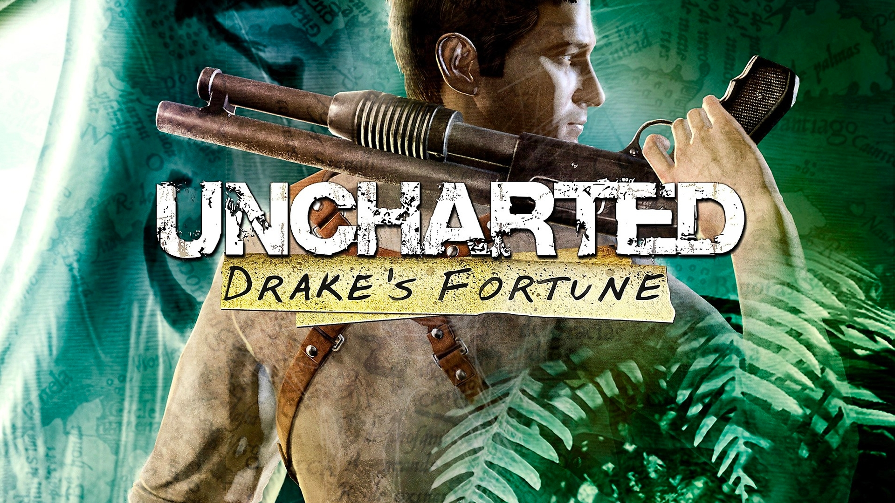
       
      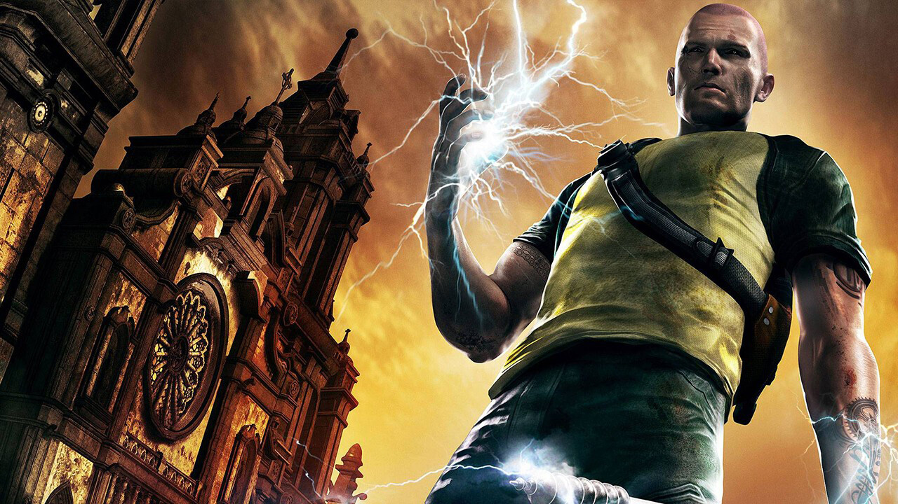
       
      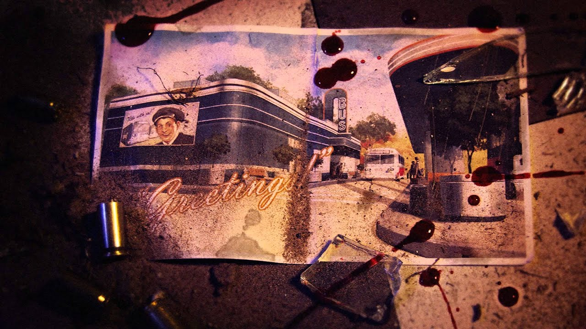
    </td>
  </tr>

  <tr><td colspan="2">
</td></tr>

  <tr>
    <td width="45%" align="center" valign="middle">
      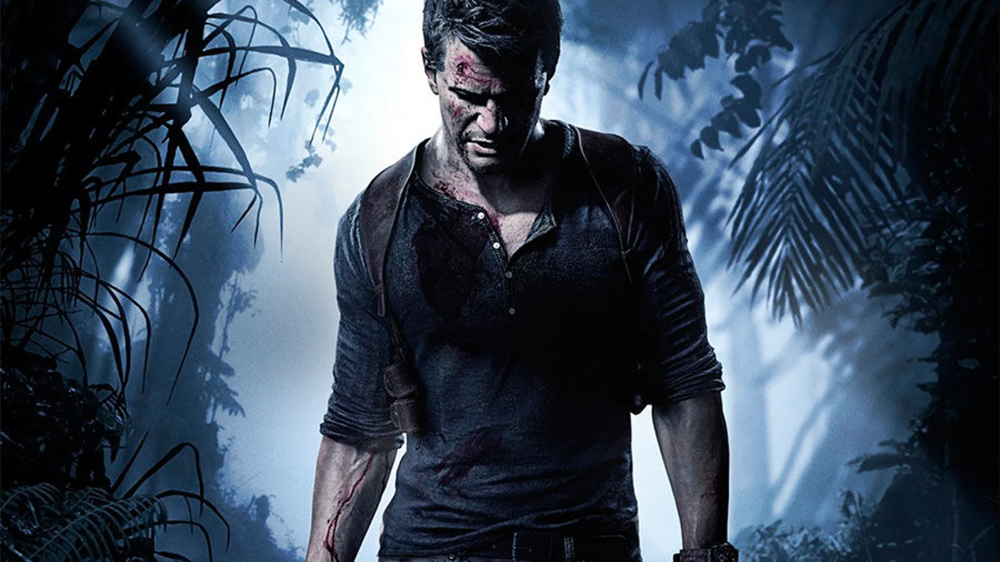
    </td>
    <td width="55%" valign="top" style="padding-left: 20px;">
      <h2>Chapter II: The PS4 Arrival</h2>
      
In 2016, I got my PS4 specifically for the release of Uncharted 4. Obviously, I played through the entire saga and became a huge Naughty Dog fan. That's also when I played The Last of Us, a game that heavily marked me because of how it handled storytelling.

      
A lot of titles went through this console. I spent years playing Minecraft with my sister (unforgettable years that had a huge impact on my life), Naruto Shippuden Ultimate Ninja Storm 4, and I put an absolute ungodly amount of hours into GTA V, beating it multiple times. There was also a Fortnite phase between 2019 and 2021; I played it a lot, though I don't see it as a game that truly transcended for me.

    </td>
  </tr>

  <tr><td colspan="2">
</td></tr>

  <tr>
    <td width="55%" valign="top">
      <h2>Chapter III: Becoming a Trophy Hunter & Stepping into PC</h2>
      
My first official registered platinum trophy was InFamous Second Son (I liked it so much I got the platinum 3 times on 3 different accounts). Right after that, I platinumed Assassin's Creed Black Flag and AC Rogue.

      
Around that exact same time, I played **Hollow Knight**. I sank countless hours into it, got obsessed with pulling off no-hits on bosses, and only missed the final Pantheon. This game made me completely fall in love with indies.

      
That very same year, I got my PC. With Hollow Knight fresh in my mind, I couldn't stop thinking about making my own game. So I looked up how to develop one, and the first recommendation was **Unity**.

      
I started in 2021 watching tutorials from Alva Majo (my biggest reference), Héctor Profe Academia, Heynau, Guinxu, and Devalen. Back then, I only made simple stuff: basic platforming, animation controls, 4-way movement, tinkering with prefabs, and simple dialogue systems. I basically just copied the code from tutorials and rarely made my own things.

    </td>
    <td width="45%" align="center" valign="middle">
      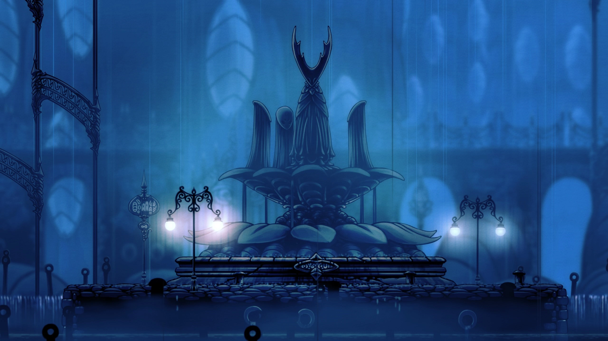
       
      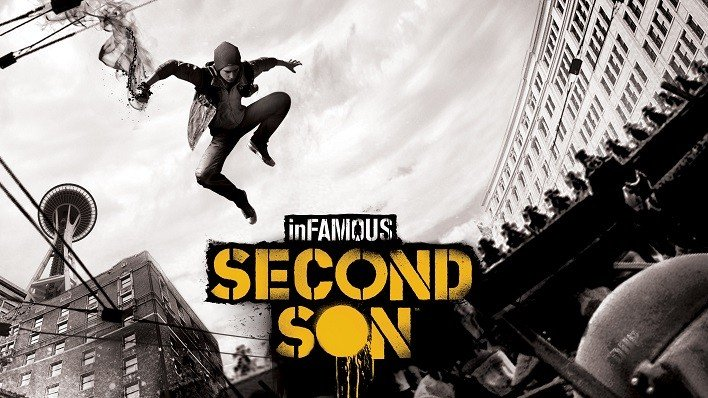
       
      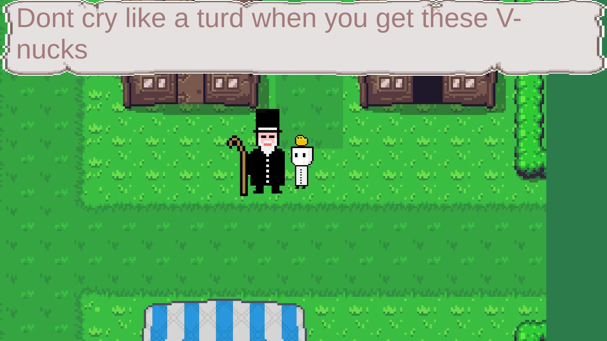
    </td>
  </tr>

  <tr><td colspan="2">
</td></tr>

  <tr>
    <td width="45%" align="center" valign="middle">
      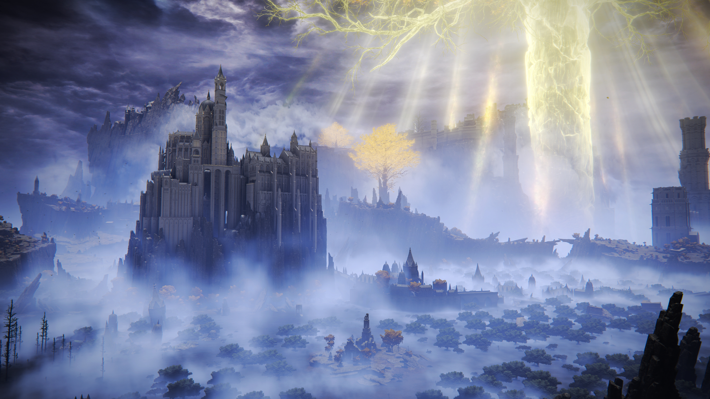
       
      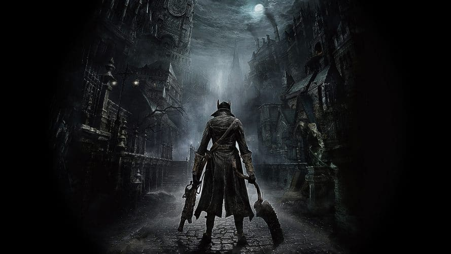
    </td>
    <td width="55%" valign="top" style="padding-left: 20px;">
      <h2>Chapter IV: FromSoftware Fever & More Platinums</h2>
      
In 2022, Elden Ring dropped and changed everything. It was my gateway into the Souls saga, which instantly became one of my favorite franchises alongside Uncharted and InFamous. I platinumed it, and that triggered me to become a much more active Trophy Hunter.

      
Next came Bloodborne, which I also platinumed, and it went straight into my top favorite games of all time. Moving to PC, I played Dark Souls 1 and 2, falling completely in love with that entire series. Also on PC, I emulated Ace Attorney (just the first one) back in 2021 before my trophy hunting days, and I absolutely loved it.

      
I kept platinuming games I played, like Blasphemous (which made me love indies even more), and I put over 40 runs into Hades. There were games I tried and didn't finish, like Nioh, and others I thoroughly enjoyed on PC like Blasphemous 2, Who's Lila, and Stardew Valley.

    </td>
  </tr>

  <tr><td colspan="2">
</td></tr>

  <tr>
    <td colspan="2" align="center">
      <h2>🏆 NOTABLE PLATINUMS</h2>
      
<i>(Just a few mentions of games I completed at 100%, not the full list)</i>

       
      <table border="0" width="90%" align="center">
        <tr>
          <td width="33%" align="left" valign="top">
            • Elden Ring 
            • Bloodborne 
            • The entire Uncharted saga (up to Lost Legacy) 
            • InFamous Second Son (x3) 
            • God of War (2018)
          </td>
          <td width="33%" align="left" valign="top">
            • God of War Ragnarok 
            • Assassin's Creed IV: Black Flag 
            • Assassin's Creed Rogue 
            • Assassin's Creed 2 
            • Blasphemous
          </td>
          <td width="33%" align="left" valign="top">
            • Little Big Planet 3 *(My rarest one!)* 
            • Stray 
            • Minecraft 
            • The South Park saga 
            • *And other indies (Bugsnax, Last Stop...)*
          </td>
        </tr>
      </table>
    </td>
  </tr>

  <tr><td colspan="2">
</td></tr>

  <tr>
    <td width="55%" valign="top">
      <h2>Chapter V: The Break & The Return</h2>
      
By the end of 2022, I stopped touching Unity. I spent the entire year of 2023 slacking off on dev work, and when I started university in 2024, I got it into my head that game dev was ridiculous and that I should look for a field with actual job opportunities. So I ignored it completely.

      
But the itch never left. Video games are what I'm truly passionate about, and games like Stardew Valley kept reminding me of that. I also spent some time playing MMOs like Trove (where I sank quite a few hours) and Albion.

    </td>
    <td width="45%" align="center" valign="top">
      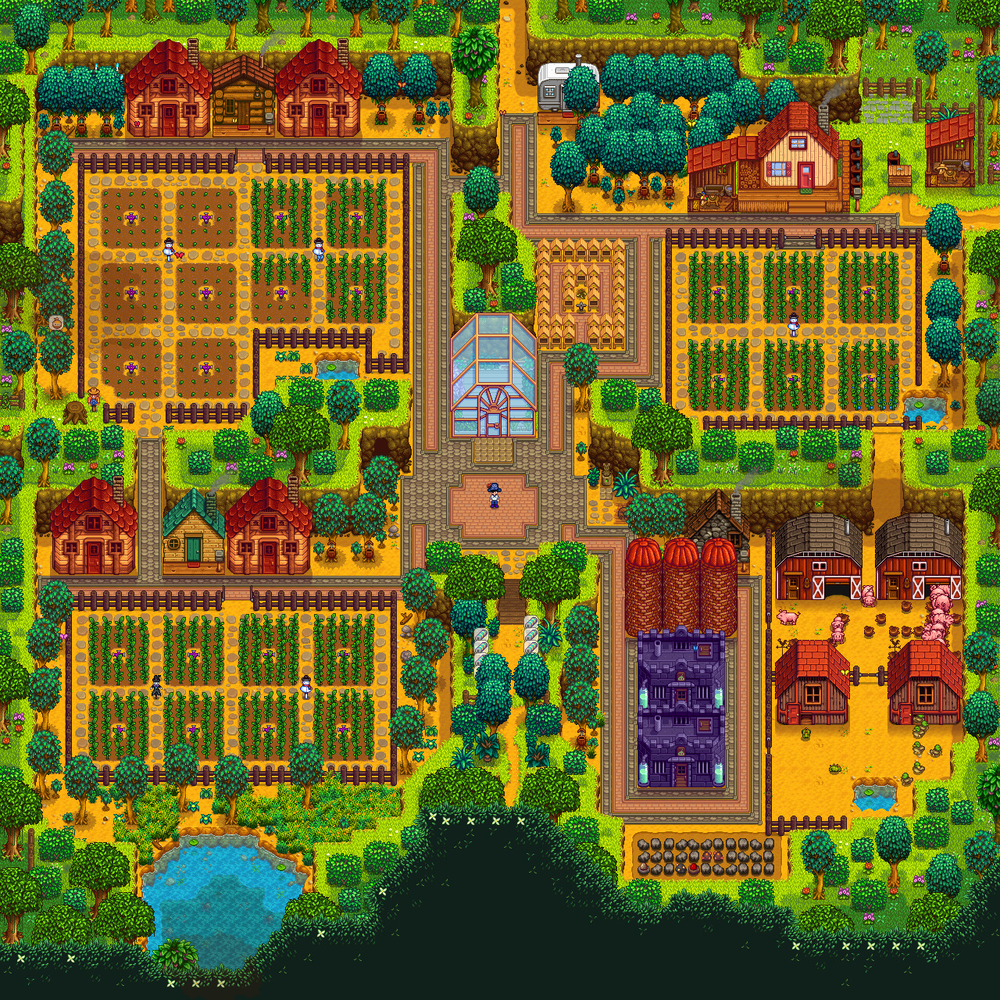
    </td>
  </tr>

  <tr>
    <td width="45%" align="center" valign="top">
      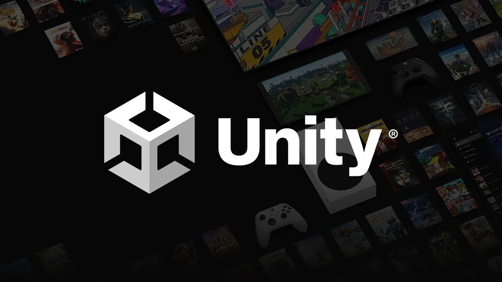
    </td>
    <td width="55%" valign="top" style="padding-left: 20px;">
      <h3>Back to the Editor</h3>
      
Last year, I decided to pick it back up for real. I dusted off what I already knew and started learning new things. The big difference now is that I actually have solid programming foundations.

      
I'm no longer blindly copying what a tutorial does; I actually understand the logic behind the code and design my own systems from scratch.

    </td>
  </tr>
</table>

---

  <a href="README.md"> <- Back to Inventory</a>

