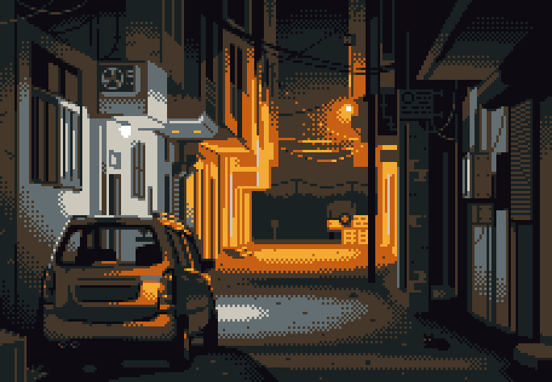

    

<h1 align="center">Hi ✌, I'm William Torres!</h1>
<h3 align="center">Game Developer in training from Nicaragua 🎮</h3>

<table>
    <tr>
        <td>
            <ul>
                <li>🎮 Passionate about <strong>Game Development</strong></li>
                <li>🎓 Currently studying at <strong>Universidad Americana (UAM)</strong>, Nicaragua</li>
                <li>🧠 Focused on growing professionally through small and constant projects</li>
                <li>🛠️ Strongest skills in <strong>Unity</strong> and <strong>.NET Framework</strong></li>
                <li>🎨 Learning game art tools like <strong>Piskel</strong> and starting with <strong>Blender</strong></li>
                <li>😄 Fun fact: I enjoy <strong>long walks</strong> :)</li> 
            </ul>
        </td>
        <td>
            
        </td>
    </tr>
</table>

<h3 align="center">Languages and Tools:</h3>

<table>
    <tr>
        <td align="center">
            <h4>🎮 Game Development</h4>
            

                
                
                
            

        </td>
        <td align="center">
            <h4>🖥️ Programming</h4>
            

                
                
            

        </td>
    </tr>
    <tr>
        <td align="center" colspan="2">
            <h4>⚙️ Tools</h4>
            

                
                
            

        </td>
    </tr>
</table>

    
    

    

