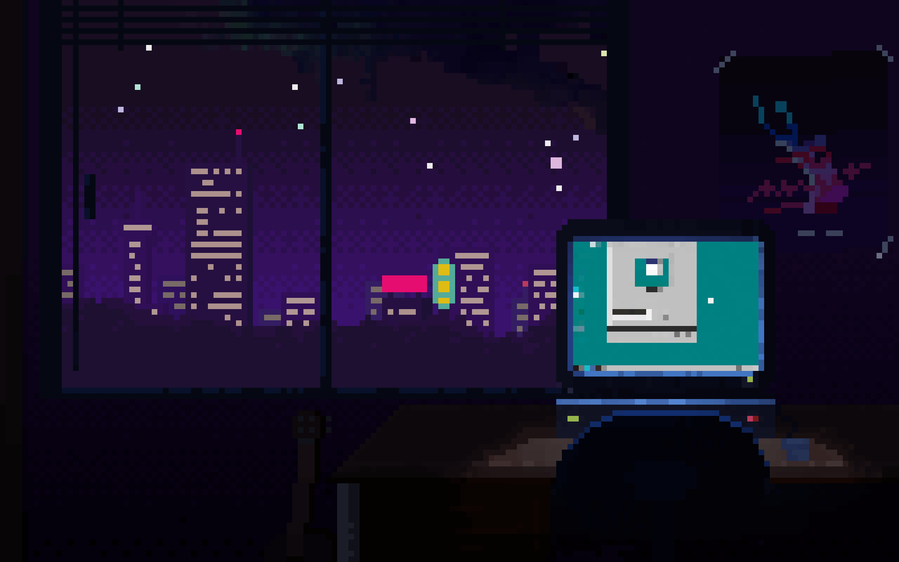
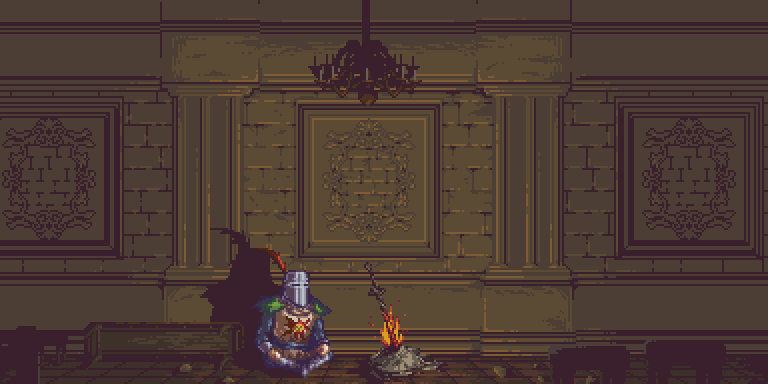
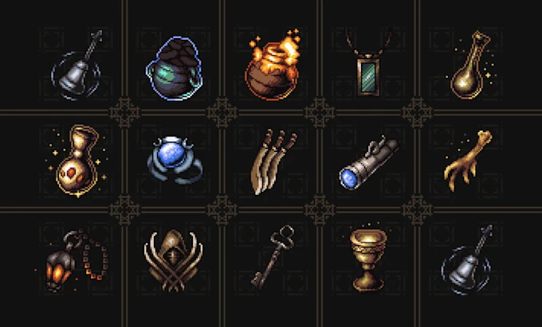
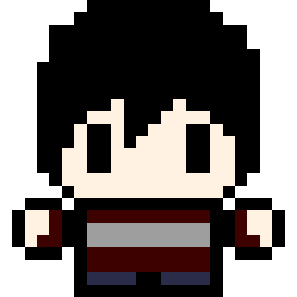
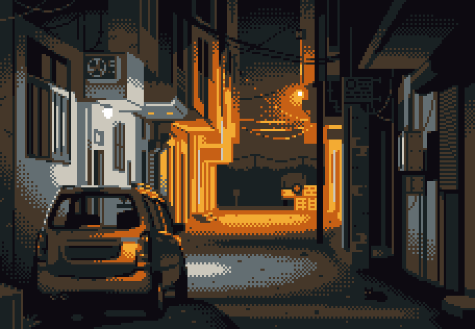

    

<h1 align="center">Hi, I'm William Torres :)</h1>

<i>Game Developer Attempt · Nicaragua</i>

<table align="center">
  <tr>
  <td align="center" valign="top" style="padding: 16px;">

  <h3 align="center">▸ Stats</h3>

  

    
  

  

    
<b>Class:</b> Game Developer

    
<b>Main Engine:</b> Unity

    
<b>Programming:</b> C# · .NET

    
<b>Origin:</b> Universidad Americana (UAM), Nicaragua

    
<b>Progression:</b> f(x) = random spikes of motivation

    
<b>Art Tools:</b> Piskel · Beginner Blender

    
<b>Trait:</b> Enjoys long walks

  

</td>

  <td align="center" valign="top" style="padding: 16px;">

  <h3 align="center">▸ Equipment</h3>

  

    
  

  <table>
    <tr>
      <td align="center" style="padding: 8px;">
            🎮 Unity 
        
      </td>
      <td align="center" style="padding: 8px;">
            🖥️ C# 
        
      </td>
    </tr>
    <tr>
      <td align="center" style="padding: 8px;">
            🎨 Piskel 
        
      </td>
      <td align="center" style="padding: 8px;">
            🖌️ Blender 
        
      </td>
    </tr>
    <tr>
      <td align="center" style="padding: 8px;">
            ⚙️ Git 
        
      </td>
      <td align="center" style="padding: 8px;">
            🐙 GitHub 
        
      </td>
    </tr>
  </table>

</td>
  </tr>
</table>

<h3 align="center">▸ Journey</h3>

  

  

  

  

<h3 align="center">[ MENTAL STATE ]</h3>

<table align="center">
  <tr>
    <td>
      
    </td>
  </tr>
</table>